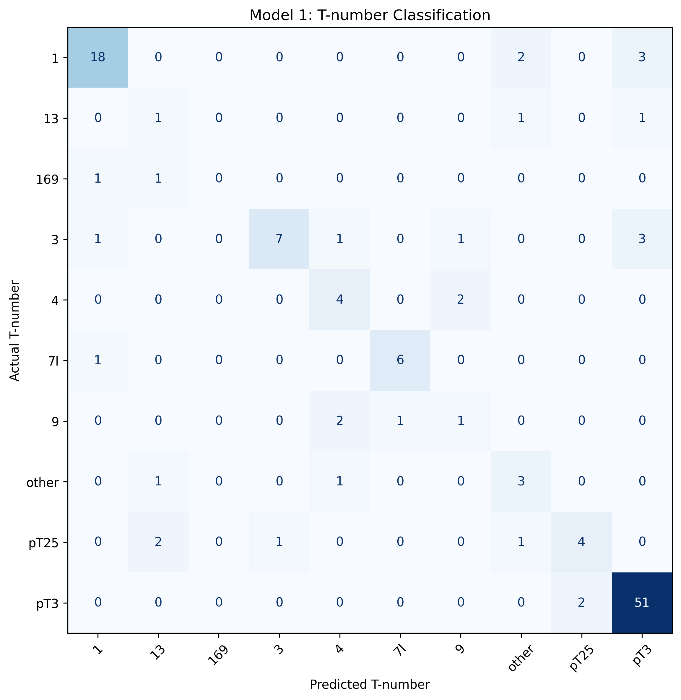
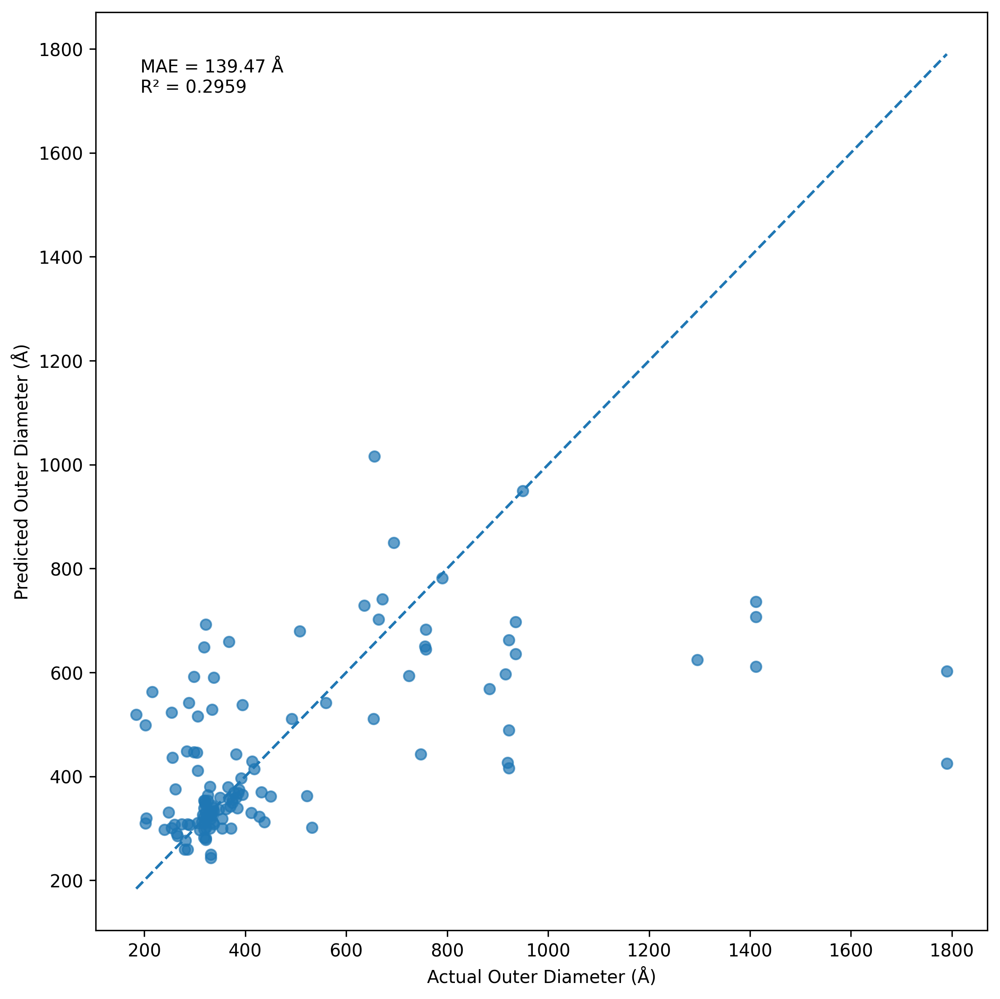

# Protein Nanocage Geometry Prediction

This repository contains the code developed for my MSc Data Science (Bioinformatics and Biological Modelling) dissertation at Durham University.

The project investigates whether protein sequence representations and graph-based structural representations can be used to predict the geometry of icosahedral protein nanocages. The main prediction targets are the **T-number** and **outer diameter** of protein assemblies.

## Project Overview

Protein nanocages are self-assembling protein structures whose geometry depends on both sequence-level and assembly-level properties. This project explores whether machine learning can capture these relationships before experimental validation.

Three modelling approaches were investigated:

1. **Model 1 — T-number classification from protein sequence embeddings**
2. **Model 2 — Outer diameter regression from sequence embeddings and T-number**
3. **Model 3 — T-number classification using graph-based structural representations**

ESM2 protein language model embeddings were used to represent protein sequences, while Graph Attention Networks (GATs) were used to investigate whether structural relationships between chains or residues provide additional predictive information.

---

## Dataset

Structural data were obtained from VIPERdb and filtered to include structures with resolution ≤ 3.5 Å.

The main data-processing pipeline was:

1. Retrieve entries from VIPERdb.
2. Add structural resolution information.
3. Retain structures with resolution ≤ 3.5 Å.
4. Download corresponding structures from the Protein Data Bank.
5. Extract protein sequences.
6. Cluster sequences to reduce sequence redundancy.
7. Split data by sequence cluster to reduce information leakage between training, validation, and test sets.
8. Generate ESM2 sequence embeddings.
9. Construct the feature matrix and graph datasets used for model training.

After structural filtering, 1,144 entries were retained. Of these, 1,143 structures were successfully retrieved.

A total of 19,424 chain sequences were extracted. Sequence clustering at 90% identity produced 821 representative sequence clusters.

The final sequence-based dataset was divided into:

- Training set: 574
- Validation set: 123
- Test set: 124

Each representative sequence was encoded using a 1,280-dimensional ESM2 embedding.

---

## Repository Structure

```text
protein-nanocage-geometry-prediction/
│
├── data_processing/
│   ├── download_viperdb.py
│   ├── summarize_viperdb.py
│   ├── add_resolution.py
│   ├── verify_entries.py
│   ├── compare_sequences.py
│   ├── download_all_pdb.py
│   ├── extract_sequences.py
│   ├── run_esm_embedding.py
│   ├── run_esm_job.sh
│   ├── split_dataset.py
│   └── build_feature_matrix.py
│
├── model1/
│   ├── model1_mlp.py
│   └── model1_xgboost.py
│
├── model2/
│   └── model2_regression.py
│
├── model3/
│   ├── model3_xgboost.py
│   ├── model3_chain.py
│   ├── model3_gat_residue.py
│   ├── extract_esm_residue.py
│   ├── build_graph_dataset_chain.py
│   └── build_graph_dataset_residue.py
│
├── figures/
│   ├── model1_confusion_matrix.png
│   └── model2_predicted_vs_actual.png
│
├── results/
│
├── README.md
└── .gitignore
```

---

## Model 1: T-number Classification

Model 1 predicts the T-number of a protein nanocage using a 1,280-dimensional ESM2 sequence embedding.

The main classifier is a multilayer perceptron (MLP) consisting of:

```text
1280 → 512 → 256 → T-number classes
```

Class weighting was used during training to reduce the effect of class imbalance.

An XGBoost classifier was also implemented as a sequence-based baseline.

The confusion matrix provides a class-level view of prediction performance:



---

## Model 2: Outer Diameter Prediction

Model 2 predicts the outer diameter of the protein assembly as a regression task.

The input consists of:

- 1,280-dimensional ESM2 embedding
- encoded T-number

giving a total input dimension of 1,281.

The MLP architecture is:

```text
1281 → 512 → 256 → 1
```

Performance was evaluated using Mean Absolute Error (MAE) and R².

The final test results were:

- **MAE: 139.47 Å**
- **R²: 0.2959**

The relationship between predicted and observed outer diameter is shown below:



The results indicate that sequence-derived information and T-number capture part of the variation in nanocage size, but substantial variation remains unexplained.

---

## Model 3: Graph-based T-number Prediction

Model 3 investigates whether structural graph representations provide additional information for predicting T-number.

Three approaches were compared:

| Model | Representation |
|---|---|
| XGBoost baseline | ESM2 sequence embedding |
| Chain-level GAT | Protein chains represented as graph nodes |
| Residue-level GAT | Residues of the representative chain represented as graph nodes |

For the chain-level representation, graph connectivity describes relationships between protein subunits in the assembled structure.

For the residue-level representation, residues are represented using per-residue ESM2 embeddings, with edges defined using Cα distances below 8 Å.

The comparison was designed to examine whether assembly-level structural information provides additional predictive value beyond sequence-derived representations.

---

## Main Findings

The experiments suggest that ESM2 embeddings contain substantial information relevant to protein nanocage geometry.

For T-number classification, graph learning did not clearly outperform the sequence-based baseline. However, the chain-level graph representation performed better than the residue-level representation, particularly in macro F1, suggesting that inter-subunit assembly information may be more informative for predicting capsid geometry than the internal structure of a single representative chain.

Performance on rare T-number classes remained limited because of substantial class imbalance in the available structural dataset.

For outer-diameter prediction, the moderate R² indicates that sequence embeddings and T-number alone are insufficient to fully explain nanocage size, suggesting that additional structural or assembly-level features may be required.

---

## Requirements

The project was developed using Python and uses packages including:

- PyTorch
- PyTorch Geometric
- scikit-learn
- XGBoost
- NumPy
- Matplotlib
- BioPython
- ESM2

ESM2 embedding generation and some graph-model experiments were performed using Durham University's Hamilton HPC environment.

---

## Data Availability

Large structural files, generated embeddings, intermediate datasets, and trained model checkpoints are not included in this repository because of their size.

The scripts in `data_processing/` document the processing pipeline used to retrieve, filter, process, and represent the structural data.

---

## Author

Rebecca Hsu  
MSc Data Science (Bioinformatics and Biological Modelling)  
Durham University